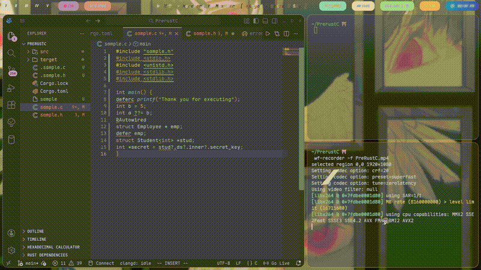

# PreRustC

### A C preprocessor written in rustlang to extend the C language

## Features Supported
- defer -> defer <name> used to free <name> at end of scope
- deferc -> defer <cmnd> Execute the <cmnd> before going end of scope
- ??= -> <lhs> ??= <rhs> Null coalesce
- ?. -> <lhs> = a?.b?.c?.d Null safe option chaining
- @Autowired -> To allocate memory and also check for successful memory allocation.
@Autowired
<typedefed struct/normal struct> <*/**> <name>
- Generics
<typedefed struct/normal struct><type> <name>

# Dependencies
1. Cargo

